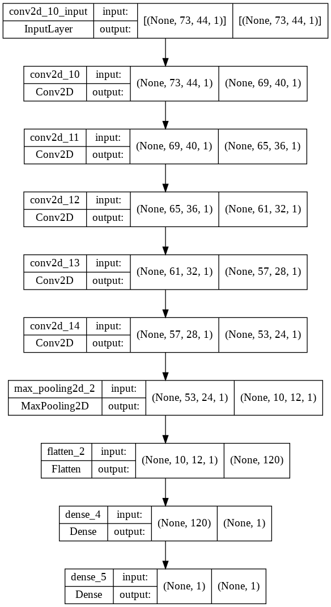

# Trained Audio Classifier ML Model For MCU

## Requirements for Python Notebook 

This project requires Python and the following Python libraries installed:

- [TensorFlow](https://www.tensorflow.org/)
- [Numpy](https://numpy.org/)
- [SciPy](https://scipy.org/)
- [keras](https://keras.io/)
- [librosa](https://librosa.org/doc/latest/index.html)

This project uses "[Speech Commands](https://arxiv.org/abs/1804.03209): A Dataset for Limited-Vocabulary Speech Recognition" dataset from Pete Warden, 2018. This dataset is 
available in tensorflow dataset library as [speech_commands](https://www.tensorflow.org/datasets/catalog/speech_commands). For initial porting to MCU, only yes and no commands 
are used. Further imporovements can be done to classify sppech commands like: 'right', 'up', 'left', 'stop', 'down' and 'go' which are already available in the dataset. Out of 
available datasets, librosa library was used to generate spectogram image which was fed to Maxpooling layer to resize the audio data to our required input size (73x44). Of the 
2000 images, 1788 audio files were used as dataset. From 1788 datas, 1688 data was used in model training with validation split of 0.2 and the remaining 100 datas were used as a
test dataset.

## Run

You will also need to have software installed to run and execute a [Jupyter Notebook](https://jupyter.org/).

If you do not have Python and Jupyter Notebook installed yet, it is highly recommended that you use 
[Google Colaboratory](https://colab.research.google.com/?utm_source=scs-index#) to run [AudioClassifier.ipynb](AudioClassifier.ipynb), which already has the above packages 
and more included.

## Code 

[AudioClassifier.ipynb](AudioClassifier.ipynb) has already implemented all the required code for downloading dateset, generating dataset to feed into developed machine learning 
model, defining Machine Learning Model using [TensorFlow](https://www.tensorflow.org/) and [Keras](https://keras.io/). For training a model, a Sequential model is used. The 
developed model uses five consecutive Conv2D layers of kernel size (5x5) with (1,1) strides. Maxpooling layer is used with size (5x2) kernel before using two fully connected 
Dense layers. The activation function used for all layers besides the last Dense layer is Exponential Linear Unit(ELU). The last Dense layer uses Sigmoid function as activation 
layer. For model training and fitting, following parameters are used:

- Optimizer: Adam   
- Loss: Binary Cross Entropy 
- Metric: Accuracy 
- Learning Rate: 0.001
- Epochs: 25
- Batch Size: 12

The loss and accuracy obtained are shown below

|Loss|Accuracy|
|:--:|:------:|
|||

The trained model weights are saved as a binary file to "weights.bin" which will be generated after running the python notebook. Also test datas are also saved as a binary 
file, which can be downloaded after running the python notebook saved as zipped folders test_data_yes.zip and test_data_no.zip. 

### Developed TensorFlow Model

## Porting trained model to CPP Program

The trained model summary is shown below:

| Layer (type)                  | Output Shape              | Paramemeter | Layer weights | Bais Weights  |
|:-----------------------------:|:-------------------------:|:-----------:|:-------------:|:-------------:|
| conv2d(Conv2D)                | (None, 69, 40, 1)         | 26          | 25            | 1             |
| conv2d(Conv2D)                | (None, 65, 36, 1)         | 26          | 25            | 1             |
| conv2d(Conv2D)                | (None, 61, 32, 1)         | 26          | 25            | 1             |
| conv2d(Conv2D)                | (None, 57, 28, 1)         | 26          | 25            | 1             |
| conv2d(Conv2D)                | (None, 53, 24, 1)         | 26          | 25            | 1             |
| max_pooling2d(MaxPooling2D)   | (None, 10, 12, 1)         | 0           | 0             | 0             |
| flatten(Flatten)              | (None, 120)               | 0           | 0             | 0             |
| dense(Dense)                  | (None, 1)                 | 121         | 120           | 1             |
| dense(Dense)                  | (None, 1)                 | 2           | 1             | 1             |

Total Trainable parameters: 253

The input shape of the spectogram image fed to the model is (73, 44, 1).

The trained model weights are extracted using model.weights() in python and saved as binary file using file handler as raw data.For each layer there are trained weights that 
are used to perform mathematical operations besides macpooling and flatten layer. For ease of convinience of porting to CPP and finally to Keil Micro Vision, the layer depth,  
Conv2D kernel size are kept at 1 and 5x5 with stride of (1,1) respectively. In addition to that, Exponential Linear Unit is used as activation function for each layer except 
the final Dense layer which uses Sigmoid activation function. For each model layer operation in python, three functionally different functions are implemented on CPP source 
file. Each layer consists of preliminary operation after which the layer is named, addition of bais and finally activation function. 

The summary of model form TensorFlow to CPP is shown below.

<table>
<caption>Details of trained model equivalence in TensorFlow and C</caption>
    <thead>
        <tr>
            <th>TensorFlow Audio Classifier Layer</th>
            <th>Audio Classifier Model ported to C</th>
        </tr>
    </thead>
    <tbody>
        <tr>
            <td rowspan=3>conv2d(Conv2D)</td>
            <td>Conv2DLayer_KernelSize5</td>
        </tr>
        <tr>
            <td>AddBais</td>
        </tr>
        <tr>
            <td>Activation_ELU</td>
        </tr>
    </tbody>
    <tbody>
        <tr>
            <td rowspan=3>conv2d(Conv2D)</td>
            <td>Conv2DLayer_KernelSize5</td>
        </tr>
        <tr>
            <td>AddBais</td>
        </tr>
        <tr>
            <td>Activation_ELU</td>
        </tr>
    </tbody>
    <tbody>
        <tr>
            <td rowspan=3>conv2d(Conv2D)</td>
            <td>Conv2DLayer_KernelSize5</td>
        </tr>
        <tr>
            <td>AddBais</td>
        </tr>
        <tr>
            <td>Activation_ELU</td>
        </tr>
    </tbody>
    <tbody>
        <tr>
            <td rowspan=3>conv2d(Conv2D)</td>
            <td>Conv2DLayer_KernelSize5</td>
        </tr>
        <tr>
            <td>AddBais</td>
        </tr>
        <tr>
            <td>Activation_ELU</td>
        </tr>
    </tbody>
    <tbody>
        <tr>
            <td rowspan=3>conv2d(Conv2D)</td>
            <td>Conv2DLayer_KernelSize5</td>
        </tr>
        <tr>
            <td>AddBais</td>
        </tr>
        <tr>
            <td>Activation_ELU</td>
        </tr>
    </tbody>
    <tbody>
        <tr>
            <td>max_pooling2d(MaxPooling2D)</td>
            <td>MaxPoolLayer</td>
        </tr>
    </tbody>
        <tbody>
        <tr>
            <td>flatten(Flatten)</td>
            <td><b>Not Required</b></td>
        </tr>
    </tbody>
    <tbody>
        <tr>
            <td rowspan=3>dense(Dense)</td>
            <td>FullyConnectedLayer</td>
        </tr>
        <tr>
            <td>AddBais</td>
        </tr>
        <tr>
            <td>Activation_ELU</td>
        </tr>
    </tbody>
    <tbody>
        <tr>
            <td rowspan=3>dense(Dense)</td>
            <td>FullyConnectedLayer</td>
        </tr>
        <tr>
            <td>AddBais</td>
        </tr>
        <tr>
            <td>Activation_Sigmoid</td>
        </tr>
    </tbody>
</table>

### Conv2DLayer_KernelSize5

Function Parameters:

| Parameter  |Data type | Description   |
|:----------:|:--------:|:-------------:|
| src        | float*   | Source image pointer on which Conv2D is performed |
| height     | int      | Height of source image |
| width      | int      | Width of source image |
| dst        | float*   | Destination image pointer on which pixel data is stored obtained after Conv2D operation |
| kernel     | float [5][5]     | Kernel values to operate Conv2D |

The 5x5 pixel data is extracted for src pointer according to the row and column position and is repeated until height and width of the 2D spectogram data. The operation is 
carried out as: 

$$dst = \sum_{i=0}^4 \sum_{j=0}^4 pixel[i][j]*kernel[i][j]$$

### AddBais

Function Parameters:

| Parameter  |Data type | Description   |
|:----------:|:--------:|:-------------:|
| val_bais   | float    | Bais value to add on obtained values |
| src_size   | int      | Size of data fed to add bais values |
| src        | float*   | Pointer to source data |

The operation is carried out using equation below for all source data values.

$$dst = pixel + val_bais$$

### MaxPoolLayer

Function Parameters:

| Parameter         | Data type | Description   |
|:-----------------:|:---------:|:-------------:|
| src               | float*    | Source data pointer to perform Maxpooling |
| dst               | float*    | Destination data pointer to store data after performing Maxpooling |
| stride_width      | int       | Maxpool stride witdh size |
| stride_height     | int       | Maxpool stride height size |
| in_height         | int       | Height of 2D input data |
| in_width          | int       | Width of 2D input data |
| dst_width         | int       | Width of 2D output data |

Maximum value of 5x2 matrix with vertical and horizontal strides of 5 and 2 pixels is used to carry out maxpooling operation.

### FullyConnectedLayer

Function Parameters:

| Parameter  | Data type | Description   |
|:----------:|:---------:|:-------------:|
| src_pixel  | float*    | Source data pointer to perform dense calculation |
| kernel     | float     | Trained model weights to perform calculation |
| length     | int       | Input dense layer size |

The operation is carried out as: 

$$dst = \sum_{i=0}^length pixel[i]*kernel[i]$$

### Activation_ELU

Function Parameters:

| Parameter  |Data type | Description   |
|:----------:|:--------:|:-------------:|
| src_size   | int      | Size of data fed to add bais values |
| src        | float*   | Pointer to source data |

For those source data values, which is less than one ELU is applied, else the same value of data is assigned.

$$src = \exp(src) - 1$$

### Activation_Sigmoid

Function Parameters:

| Parameter  |Data type | Description   |
|:----------:|:--------:|:-------------:|
| src_size   | int      | Size of data fed to add bais values |
| src        | float*   | Pointer to source data |

For all source data values Sigmoid function is applied.

$$src = 1 / ( 1 + \exp(-src))$$

## Deploy to Visual Studio Project

The saved weights were read from the binary file "weights.bin" and the datas were read form folder test_data_yes and test_data_no. After reading the model weights and audio 
binary data, it can be fed to inference function to make a prediction. Also, activation functions for ELU and Sigmoid are also taken into consideration and used after addition 
of bais values. 

# Porting Model to Keil Micro Vision for Implementation in MCU

## Deploy to Keil Micro Vision Project for MCU TM4C129xxx 

For porting to MCU, the size limit is 32 kB, thus only weight values are assigned along with one audio sample data during initialization in the main function and model 
inference function is called for prediction. Initialize_ModelParameters function replaced with Read_ModelParamaters which are fulnctionally similar with addition to assigning 
sample audio data. All the functions from Visual Studio were used with adjustments to fit Keil Micro Vision 5 Project scope.

The imaze size of the binary are as follows:

| Program   | Size      |
|:---------:|:---------:|
| Code      | 17000     |
| RO - Data | 15036     |
| RW - Data | 16        |
| ZI - Data | 175296    |

Compile and run the program in Simulation mode if you do not have a hardware. Run the program in debug mode, put a breakpoint on ModelInference function call and monitor the 
value of prediction. If the value of prediction is greater than 0.5 the predicted fed data is "Yes" else "No". 

