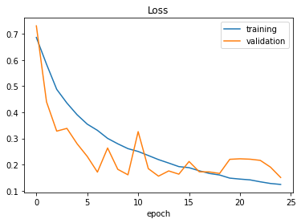
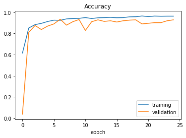

# Trained Audio Classifier ML Model For MCU

## Requirements for Python Notebook 

This project requires Python and the following Python libraries installed:

- [TensorFlow](https://www.tensorflow.org/)
- [Numpy](https://numpy.org/)
- [SciPy](https://scipy.org/)
- [keras](https://keras.io/)
- [librosa](https://librosa.org/doc/latest/index.html)

This project uses "[Speech Commands](https://arxiv.org/abs/1804.03209): A Dataset for Limited-Vocabulary Speech Recognition" dataset from Pete Warden, 2018. This dataset is 
available in tensorflow dataset library as [speech_commands](https://www.tensorflow.org/datasets/catalog/speech_commands). For initial porting to MCU, only yes and no commands 
are used. Further imporovements can be done to classify sppech commands like: 'right', 'up', 'left', 'stop', 'down' and 'go' which are already available in the dataset. Out of 
available datasets, librosa library was used to generate spectogram image which was fed to Maxpooling layer to resize the audio data to our required input size (73x44). Of the 
2000 images, 1788 audio files were used as dataset. From 1788 datas, 1688 data was used in model training with validation split of 0.2 and the remaining 100 datas were used as a
test dataset.

## Run

You will also need to have software installed to run and execute a [Jupyter Notebook](https://jupyter.org/).

If you do not have Python and Jupyter Notebook installed yet, it is highly recommended that you use 
[Google Colaboratory](https://colab.research.google.com/?utm_source=scs-index#) to run [AudioClassifier.ipynb](AudioClassifier.ipynb), which already has the above packages 
and more included.

## Code 

[AudioClassifier.ipynb](AudioClassifier.ipynb) has already implemented all the required code for downloading dateset, generating dataset to feed into developed machine learning 
model, defining Machine Learning Model using [TensorFlow](https://www.tensorflow.org/) and [Keras](https://keras.io/). For training a model, a Sequential model is used. The 
developed model uses five consecutive Conv2D layers of kernel size (5x5) with (1,1) strides. Maxpooling layer is used with size (5x2) kernel before using two fully connected 
Dense layers. The activation function used for all layers besides the last Dense layer is Exponential Linear Unit(ELU). The last Dense layer uses Sigmoid function as activation 
layer. For model training and fitting, following parameters are used:

- Optimizer: Adam   
- Loss: Binary Cross Entropy 
- Metric: Accuracy 
- Learning Rate: 0.001
- Epochs: 25
- Batch Size: 12

The loss and accuracy obtained are shown below

|Loss|Accuracy|
|:--:|:------:|
|||

The trained model weights are saved as a binary file to "weights.bin" which will be generated after running the python notebook. Also test datas are also saved as a binary 
file, which can be downloaded after running the python notebook saved as zipped folders test_data_yes.zip and test_data_no.zip. 

### Developed TensorFlow Model
[!plot](Images/model.png)

## Deploy to Visual Studio Project

The saved weights were read from the binary file "weights.bin" and the datas were read form folder test_data_yes and test_data_no. After reading the model weights and audio 
binary data, it can be fed to inference function to make a prediction. When porting following layers and functions can be seen as equivalent.

| TensorFlow Layer               | AudioClassifier Function |
|:------------------------------:|:------------------------:|
| Conv2D(kernel_size=(5,5))      | Conv2DLayer_KernelSize5  |
| MaxPooling2D(pool_size=(5, 2)) | MaxPoolLayer             |
| Flatten                        | Not Required - 1D raw data used |
| Dense                          | FullyConnectedLayer      |

Also, activation functions for ELU and Sigmoid are also taken into consideration and used after addition of bais values. 

## Deploy to Keil Micro Vision Project for MCU TM4C129xxx 

For porting to MCU, the size limit is 32 kB, thus only weight values are assigned along with one audio sample data during initialization in the main function and model 
inference function is called for prediction. Initialize_ModelParameters function replaced with Read_ModelParamaters which are fulnctionally similar with addition to assigning 
sample audio data. All the functions from Visual Studio were used with adjustments to fit Keil Micro Vision 5 Project scope.

The imaze size of the binary are as follows:

| Program   | Size      |
|:---------:|:---------:|
| Code      | 17000     |
| RO - Data | 15036     |
| RW - Data | 16        |
| ZI - Data | 175296    |

Compile and run the program in Simulation mode if you do not have a hardware. Run the program in debug mode, put a breakpoint on ModelInference function call and monitor the 
value of prediction. If the value of prediction is greater than 0.5 the predicted fed data id "Yes" else "No". 

